#Android内存泄漏检测
检测工具
一、Leakcanary
-
####1、使用

```java
在app build.gradle 中加入引用：  
debugImplementation 'com.squareup.leakcanary:leakcanary-android:1.6.3'
releaseImplementation 'com.squareup.leakcanary:leakcanary-android-no-op:1.6.3'
debugImplementation 'com.squareup.leakcanary:leakcanary-support-fragment:1.6.3'
```
在Application中

```java
private RefWatcher refWatcher;
private void initLeak() {
    refWatcher = setupLeakCanary();
}

private RefWatcher setupLeakCanary() {
	if (LeakCanary.isInAnalyzerProcess(this)) {
	  return RefWatcher.DISABLED;
	}
	return LeakCanary.install(this);
}

public static RefWatcher getRefWatcher(Context context) {
    BaseApplication leakApplication = (BaseApplication) context.getApplicationContext();
    return leakApplication.refWatcher;
}
```
在AndroidManifest.xml中

```java
<uses-permission android:name="android.permission.WRITE_EXTERNAL_STORAGE" />
<uses-permission android:name="android.permission.MOUNT_UNMOUNT_FILESYSTEMS" />
```
在Acitivity的onCreate方法中

```java
BaseApplication.getRefWatcher(this).watch(this);
```
在Fragment的onDestroy方法中

```java
BaseApplication.getRefWatcher(this).watch(this);
```
当检测到某个Activity或者Frgment有内存泄露，LeakCanary 就会给出提示。
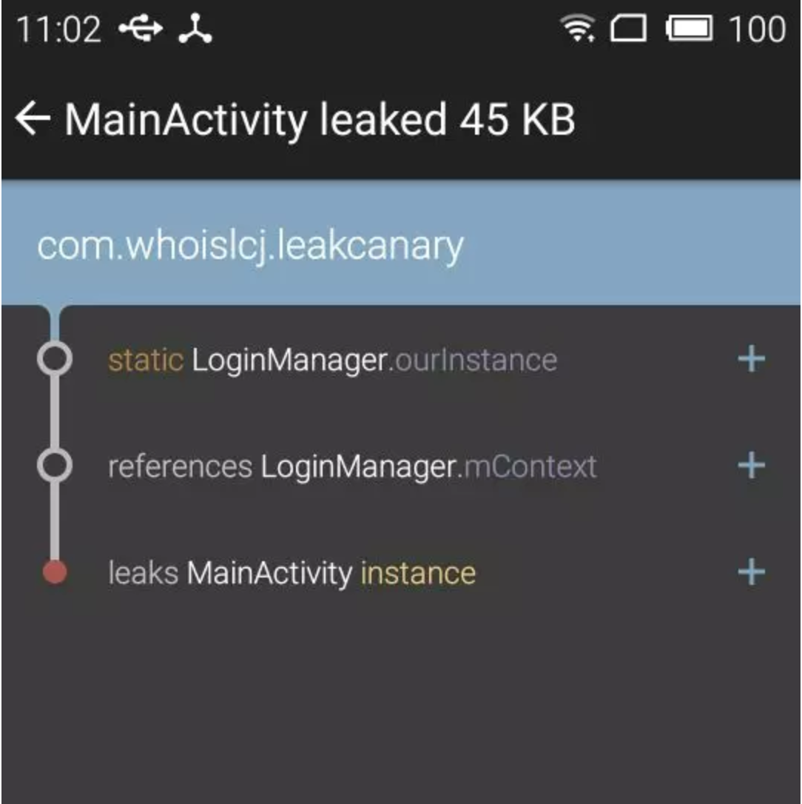
####2、原理介绍  
1. 触发检测  
每次当Activity/Fragment执行完onDestroy生命周期，LeakCanary就会获取到这个Activity/Fragment，然后初始化RefWatcher对它进行分析，查看是否存在内存泄漏。  
2. 判断是否存在内存泄漏
首先尝试着从ReferenceQueue队列中获取待分析对象（软引用和弱引用可以和一个引用队列（ReferenceQueue）联合使用，如果软引用或弱引用所引用的对象被垃圾回收器回收，Java虚拟机就会把这个软引用或弱引用加入到与之关联的引用队列中），如果不为空，那么说明正在被系统回收，如果直接就返回DONE，说明已经被系统回收了，如果没有被系统回收，可能存在内存泄漏，手动触发系统GC，然后再尝试移除待分析对象，如果还存在，说明存在内存泄漏。  
3. 分析内存泄漏
确定有内存泄漏后，调用heapDumper.dumpHeap()生成.hprof文件目录。HAHA 是一个由 square 开源的 Android 堆分析库，分析 hprof 文件生成Snapshot对象。Snapshot用以查询对象的最短引用链。找到最短引用链后，定位问题，排查代码将会事半功倍。  

####3、总结：
LeakCanary对于内存泄漏的检测非常有效，但也并不是所有的内存泄漏都能检测出来。

* 无法检测出Service中的内存泄漏问题。   
* 如果最底层的MainActivity一直未走onDestroy生命周期(它在Activity栈的最底层)，无法检测出它的调用栈的内存泄漏。  
所以说LeakCanary针对Activity/Fragment的内存泄漏检测非常好用，但是对于以上检测不到的情况，还得配合Android Monitor + MAT 来分析。

二、Memory Profiler
-
####1、简介
Memory Profiler是Android Profiler中的一个组件，Android Profiler是Android Studio3.0以后用来替换之前Android Monitor的观察工具，主要用来观察内存，网络，cpu温度。它能够让识别出来内存泄漏和内存抖动，导致应用卡顿，anr和crash. 它可以展示一个内存使用的真实图表，从而知道当时内存使用情况，还能强制内存回收，和跟踪内存分配。
####2、使用
1. 点击工具栏中的Profile按钮将待分析的App安装到设备上，也可以直接安装，在AS底部选择Android Profiler按钮
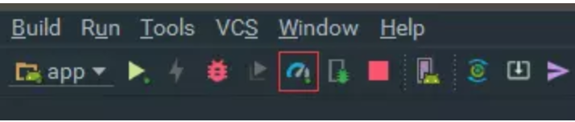
2. 进入Profiler
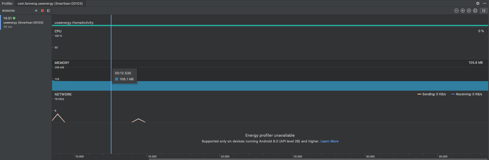
3. 点击MEMORY进入内存详情，在这里可以实时查看内存的占用情况
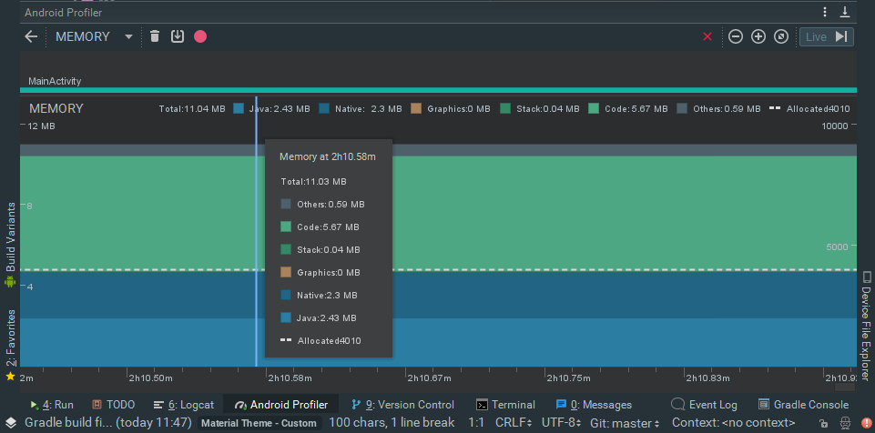
4. Memory Profiler主面板介绍
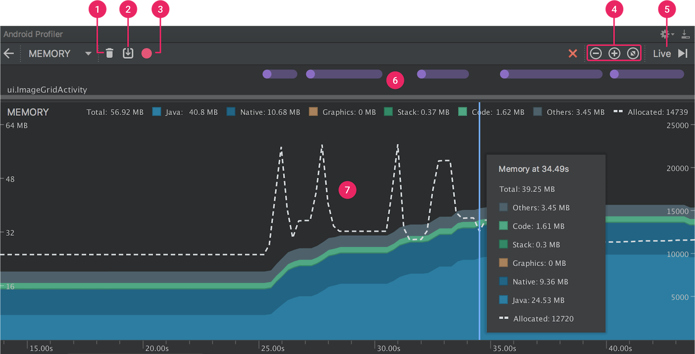
1: 强制内存回收按钮  
2: Dump the Java heap  
3: 开始／停止记录内存分配情况  
4: 缩小／放大时间线  
5: 实时播放内存分配情况（这个按钮点下试试便清楚了）  
6: 发生一些事件的记录(如Activity的跳转，事件的输入，屏幕的旋转)  
7: 内存使用时间线  
包含多少内存被使用（左边的y轴），还有顶上的颜色标记内存的类型，右边的y轴表明分配对象的个数,另外出现垃圾回收事件会有一个小图标。  

#####关于顶部的几种内存类型介绍：  

* Java : java代码分配的内存  
* Native:c/c++代码分配的内存(有时候其实并没有使用到c/c++代码,但还是会有Native的内存分配，因为Android Framework会去通过java代码访问一些需要使用Native的资源，如图像资源Bitmap)  
* Graphics:图像缓存等，包括GL surfaces, GL textures等   
* Stack:栈内存（包括java和c/c++）  
* Code:代码的内存分配（例如代码，资源，libs等等）  
* Other:这个是连系统都不知道是什么类型的内存，放在这里  
* Allocated: jave分配的对象个数 (在Android7.1和以下的设备，这个计数是在设备连接后开始，所以并不是app启动时候的计数。Android8.0或更高，在系统里面内置的Profiler工具，所以无论什么时候连接，都是app启动时候的计数)  

#####为什么要去观察应用内存的使用情况  
Memory Profiler是用来解决内存分配中产生抖动，导致应用卡顿，anr和crash问题. 在Android系统内存管理上，它是提供一套内存回收机制去回收无用的对象，其实就是Dalvik虚拟机的垃圾回收器，当垃圾回收器启动回收机制的时候，其实会对应用的运行产生一点影响，但是这种影响来说一般微乎其微，察觉不到。但是如果你的内存分配比垃圾回收快很多，这种情况可能导致垃圾回收器回收内存不及时，从而导致应用出现卡顿的现象.(这其实就是内存抖动所产生的影响). 另外一个问题就是内存泄漏，内存的持续泄漏可能导致内存溢出，从而app运行出现outofmem异常。
Memory Profiler通过以下方面防治上面出现的问题：

* 观察不必要的内存分配。（这种内存分配导致效率降低） 
* Dump the Java heap 去观察指定时间对象的在内存中的分配情况，若干次Dump能够帮助你发现内存泄漏
* 测试极端的用户交互情况下的内存分配（比如说狂点某个请求按钮），看看内存使用情况如何，是否出现内存抖动.

#####观察对象分配
8.0以上的设备，不需要点击Memory Profiler主面板中的按钮3，就可以观察某一段时间的内存分配情况，如果是7.1或以下是需要点击按钮3开始和停止。

* Android8.0观察一段时间的内存分配情况

* Android7.1或以下观察一段时间的内存分配情况

当分析结束后会弹出如下面板:
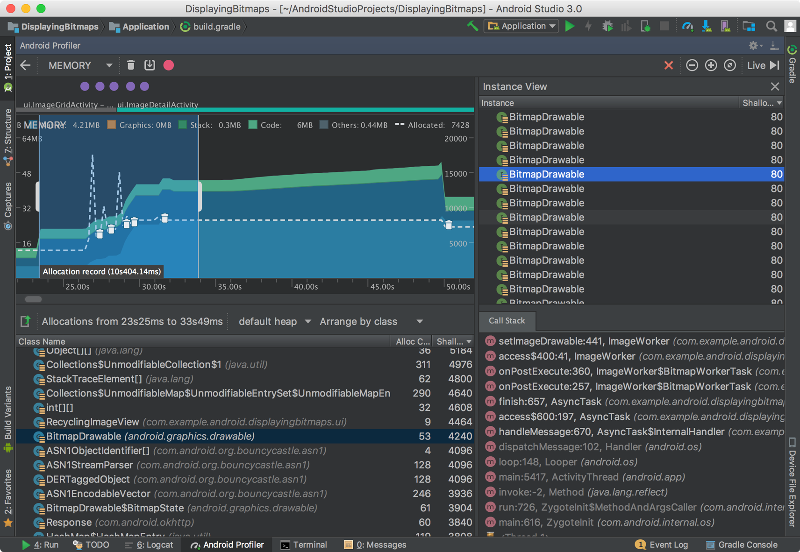

查看对象分配情况   

1. 在Class Name列看一下有没有异常分配的对象，个数很多，占用内存比较大。点击头部Class Name进行一个按字母排序操作，点击Class Name面板下面的类名可以看到Instance View面板详细的对象信息。
2. 点击Instance View面板中的对象，可以看到调用栈信息和调用的线程。
3. 在Call Stack中点击可以跳转到实际的代码。
以上是捕获一段时间的内存分配情况，如果想捕获一瞬间的内存分配需要用到heap dump。

#####捕获一个heap dump
捕获一个heap dump观察某一个时间点的对象分配情况，注意之前介绍是一个时间段，而这里是时间点。它有助于帮助我们分析内存泄漏，比如当我应用使用一段时候后，捕获了一个heap dump，这个heap dump里面发现了并不应该存在的对象分配情况，这说明是存在内存泄漏的。通过一个heap dump你可以看到以下内容：  

1. 你的app分配了什么样的对象类型，每个类型分配了多少个数和大小。
2. 使用了多少内存。
3. 每个对象在代码中的使用位置。
4.对象分配的调用栈情况。
捕获一个heap dump在工具栏中点击之前面板介绍中的按钮2，稍等一会儿便能够看到类似于之前记录内存分配后的面板弹出。
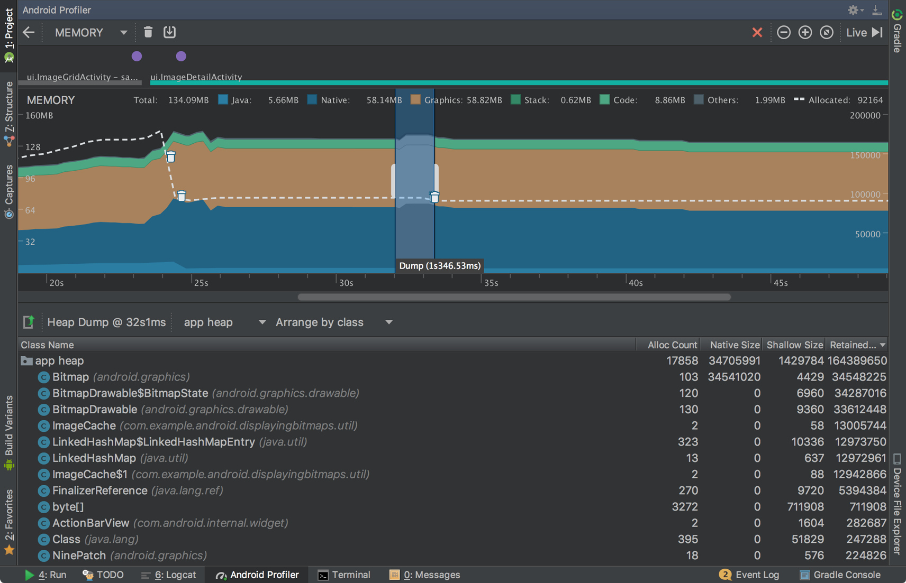
从该面板可以获得如下信息：

* Class Name : 这个很好理解，就是类名
* Allocations : 对象个数
* Native Size : c/c++层内存大小(bytes)
* Shallow Size : java层内存大小(bytes)
* Retained Size : 这个是这个类中所引用到的对象的总大小 * 该类对象的个数

当点击app heap下拉列表会出现3个选项

* Default heap: 这个我也不太明白是什么意思
* App heap: app中的堆分配
* Image heap: 图像的堆分配
* Zygote heap: 这个按照官方的解释是来自安卓系统fork进程的地方产生的写数据备份

当点击Arrange by class下拉列表会出现3个选项

* Arrange by class:根据类名进行分组
* Arrange by package:根据包名进行分组
* Arrange by callstack:根据调用栈进行分配

当我们点击其中一个类的时候会弹出一个新的Instance View面板,如下图：
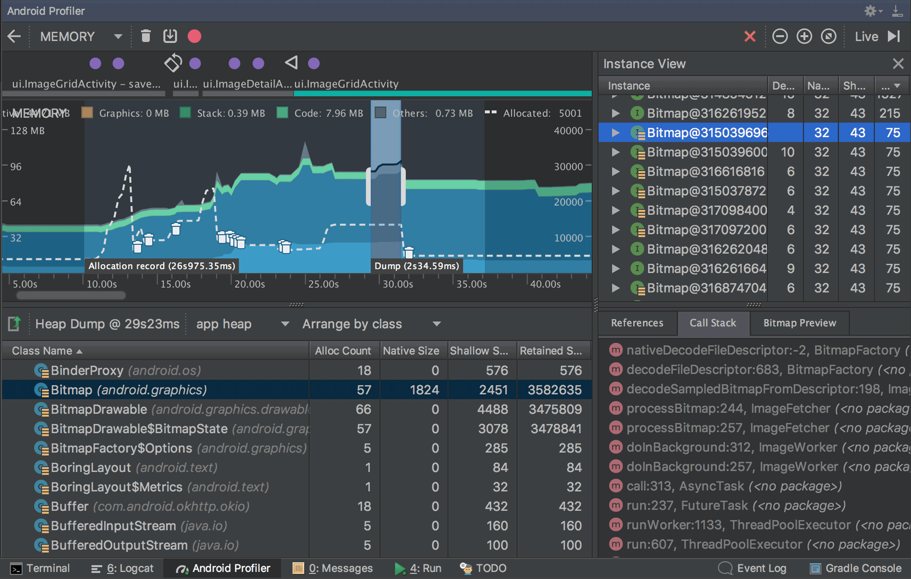
每列中包括以下：

* Depth: GC root到达该实例的最短跳数
* Native Size: c/c++层中内存的大小(bytes)
* Shallow Size:java层内存大小(bytes)
* Retained Size:这个类中所引用到的对象的总大小(bytes)
另外，heap dump是看不到调用栈信息的.也就是上图中的Call Stack面板。

分析你的heap,按照一下步骤:

1. 浏览Class Name列表,看看有没有大量对象存在，并且这些对象你认为是不应该存在的，可能存在内存泄漏的情况. 点击类名可以看到详细的对象信息.
2. 在这个Instance View面板中，点击一个实例References面板就会显示出来，里面都是使用该Instance的Reference，点击剪头可以看到引用它的所有区域。点击鼠标右键可以选择go to instance去看到引用该引用的引用，或者jump to source去看调用的源代码。

一般出现内存泄漏的原因有:

1. 长期引用到Activity,Context,View,Drawable的对象。
2. 非静态的内部类，例如Runnable它可以引用到Activity的实例
3. 一些长期缓存对象

####3、举例
查找内存泄漏方式：

1. 启动应用，看一下当前内存使用了多少，使用应用一段时间后, 退回到应用首页，看看当前内存又是多少。进行一次heap dump, 看看结果，分析一下有没有可疑的对象分配（比如说大量重复的Activity，同一个类型对象比较多，对象内存占用较大）。
2. 发现可疑点后，通过分析结果，可以找到相应代码，找到代码当然也能找到使用代码的场景，例如是Activity泄漏，反复进行画面的跳转，然后强制gc回收，看看内存是否存在只增不减的情况。
3. 使用allocation跟踪一段时间内存分配情况，拿出来做分析。

例子：

1. 首先启动一个疑似存在内存泄漏app,然后使用了一段时间，进行了一次heap dump, 结果如下：
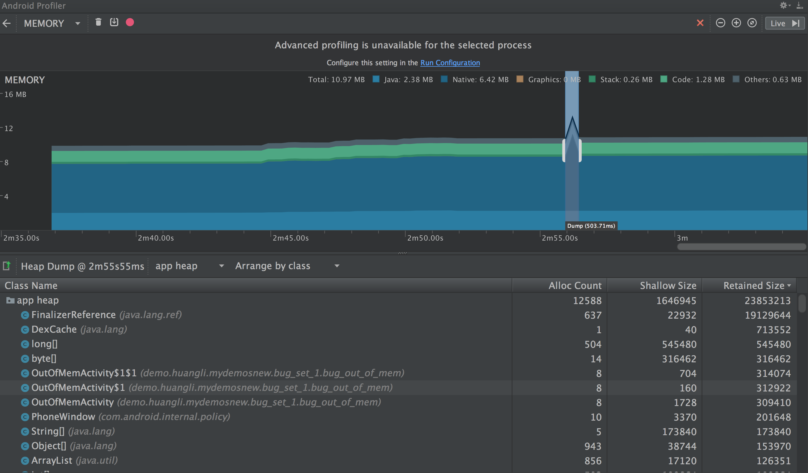
2. 发现了一个可疑的类OutOfMemActivity, 它存在多个实例，实际上在已知该app业务逻辑中是不应该会有这么多OutOfMemActivity实例的，于是我变点开它的Instance View。  
可疑点如红色剪头所指，因为外部类实例引用到Activity都是不正常的操作，这里Broadcast的实例引用到了Activity。
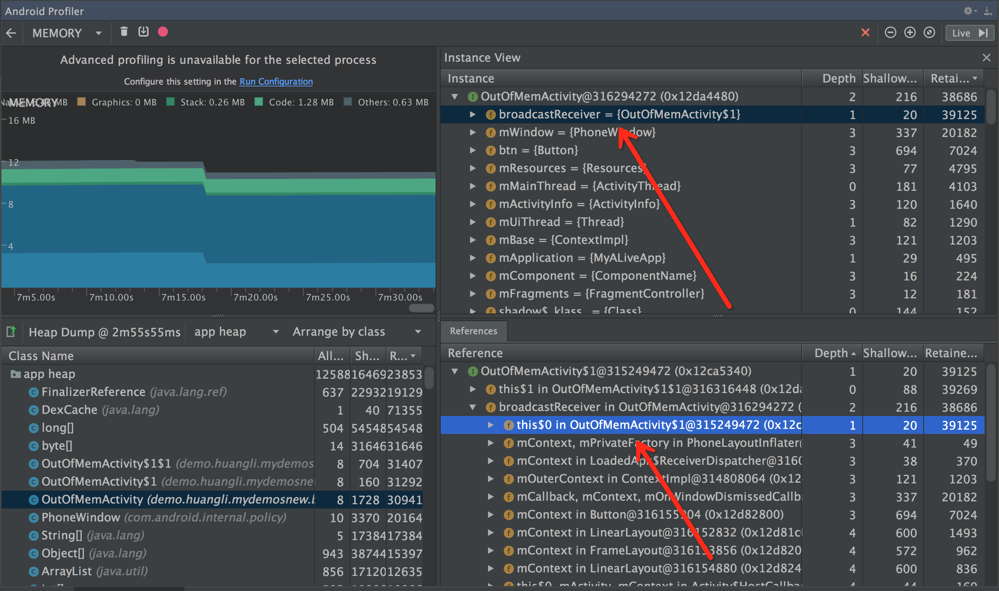
3. 点击跳转到源码，发现是内部类引用到外部类实例(Activity)的情况导致了内存泄漏。
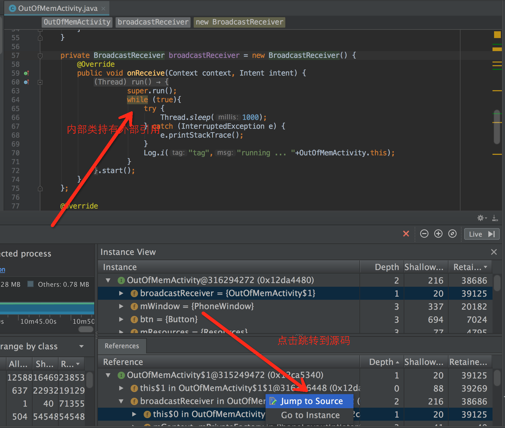
4. 修改导致内存泄漏的代码。


